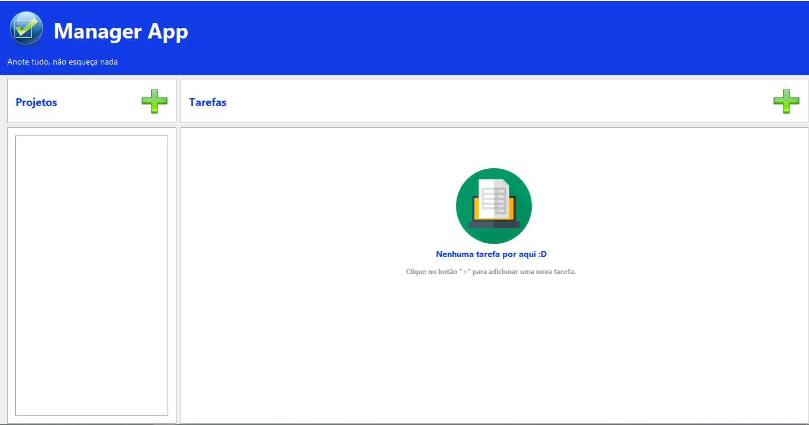
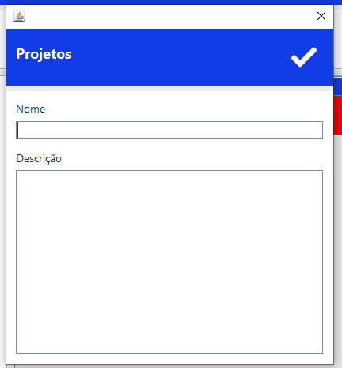
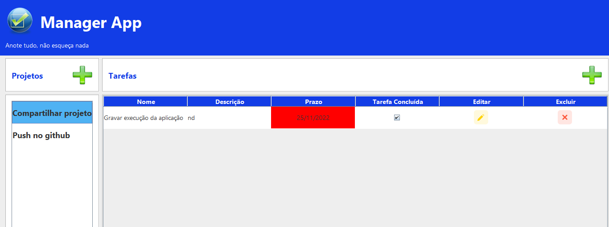

## Aplicação desenvolvida para gerenciar projetos
 

### Olá!!! 👋

Esse repositório contém um projeto desenvolvido em Java, durante as aulas de Lógica de Programação do programa Start By Capgemin.  
 

### 🛠️ Tecnologias utilizadas

 
 
 

***

## Projeto
O projeto desenvolvido para o gerenciamento de projetos e as tarefas envolvidas nesses projetos.

### Objetivo
Resolver a questão de organização de tarefas de um ou vários projetos.

### Requisitos
* A aplicação deve permitir criar uma projeto (CRUD)
* A aplicação deve permitir editar uma projeto (CRUD)
* A aplicação deve permitir excluir uma projeto (CRUD)
* A aplicação deve permitir buscar uma projeto (CRUD)

* A aplicação deve permitir criar uma tarefa (CRUD)
* A aplicação deve permitir editar uma tarefa (CRUD)
* A aplicação deve permitir excluir uma tarefa (CRUD)
* A aplicação deve permitir buscar uma tarefa (CRUD)

* A aplicação deve permitir criar uma tag (CRUD)
* A aplicação deve permitir editar uma tag (CRUD)
* A aplicação deve permitir excluir uma tag (CRUD)
* A aplicação deve permitir buscar uma tag (CRUD)

### Regras de negócio
- O sistema não contará com um sistema de login
- Não haverá o conceito de usuário
- Toda tarefa deve pertencer a uma lista
- Não podem haver tags repetidas numa mesma tarefa	
- Deve ser possivel filtrar as tarefas por tag

### Entidades

Projeto
- Nome
- Tarefas
- Data de Criação
- Data de Atualização

Tarefa
- Nome
- Descrição
- Status
- Tags
- Observações
- Prazo
- Data de Criação
- Data de Atualização

Tag
- Nome
- Cor
- Data de Criação
- Data de Atualização

***
 

## 📌 Visualização
 

### Tela principal

 

### Tela para cadastro de um projeto

 

### Tela para cadastro de uma tarefa

 

### Tela com exemplo preenchido

 